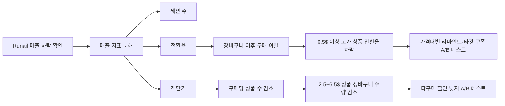

# Runail의 매출 하락 원인 진단과 타깃 프로모션 전략 고객 행동 데이터 기반 객단가·전환율 개선 분석

_본 README는 프로젝트의 전체 내용을 요약한 문서이며, 상세한 분석 근거와 시각화는 발표자료를 참고해 주세요._
📎 [프로젝트 발표자료 보기](/개인프로젝트_2026/presentation.pdf)

화장품 이커머스 행동 데이터를 활용해 **Runail의 매출 하락 원인을 진단하고, 가격대별 고객 행동에 맞춘 프로모션 전략을 제안한 프로젝트**입니다.

## 프로젝트 흐름



## 문제 정의

분석 대상 기간 중 Runail의 1월 대비 2월 매출은 **30.3% 감소**했습니다.

시장 전체 매출도 하락했지만 Runail의 감소 폭이 상대적으로 컸기 때문에, 다음 질문을 중심으로 분석을 진행했습니다.

> Runail의 매출 하락은 세션 수, 전환율, 객단가 중 어떤 지표에서 비롯되었으며, 고객 여정의 어느 단계에서 개선 기회를 찾을 수 있는가?

## 원인 분석

매출을 다음과 같이 분해해 원인을 단계적으로 확인했습니다.

```text
매출 = 전체 세션 수 × 전환율 × 객단가
```

분석 결과, Runail은 세션 수·전환율·객단가가 모두 감소했습니다. 다음 두 가지 문제를 중심적으로 분석하였습니다.

1. **객단가 하락**
   - 평균 상품 가격보다 구매당 상품 수의 감소 폭이 컸습니다.
   - 판매량이 가장 집중된 **2.5~6.5$ 상품군의 세션당 장바구니 담기 수량이 크게 감소**했습니다.

2. **전환율 하락**
   - 장바구니 담기 이후 구매까지의 고객 행동을 가격대별로 분석했습니다.
   - **6.5$ 이상 고가 상품군의 장바구니 전환율이 상대적으로 크게 하락**한 것으로 나타났습니다.
   - 6.5$ 미만 상품은 장바구니 담기 후 30분 이내 구매 비중이 높아, 구매 시점에 맞춘 리마인드 가능성을 확인했습니다.

## 해결방안

분석 결과를 바탕으로 가격대별 고객 행동에 맞춘 A/B 테스트를 제안했습니다.

| 문제 | 제안한 해결방안 |
|---|---|
| 2.5~6.5$ 상품의 장바구니 수량 감소 | 다구매 조건부 할인 넛지 배너 테스트 |
| 6.5$ 미만 상품의 장바구니 방치 | 장바구니 담기 후 30분 시점 리마인드 알림 테스트 |
| 6.5$ 이상 상품의 장바구니 전환율 하락 | 24시간 방치 고객 대상 타깃 할인 쿠폰 테스트 |

각 실험은 Primary KPI인 전환율이나 장바구니 수량뿐 아니라 Guardrail KPI인 이탈률과 순마진율을 함께 확인하도록 설계했습니다.
